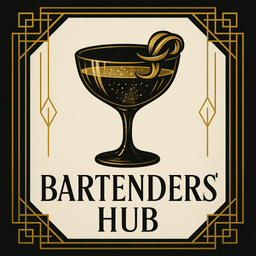

# 🥃 BartendersHub

<div align="center">
  

**Where sophistication and mastery meets artistry**

_Step into the golden age of cocktails with the most exclusive and sophisticated
bartending experience_

[](https://reactjs.org/)
[](https://vitejs.dev/)
[](https://tailwindcss.com/)
[](https://developer.mozilla.org/en-US/docs/Web/JavaScript)
[](https://nodejs.org/)
[](https://expressjs.com/)
[](https://www.mongodb.com/)

</div>

---

## 🎭 About The Project

BartendersHub is a sophisticated web application that brings the elegance of the
1920s speakeasy era to modern cocktail culture. Inspired by the Art Deco
movement, our platform connects master mixologists and cocktail enthusiasts in a
premium digital experience.

### ✨ Key Features

-   **🍸 Premium Cocktail Collection** - Curated selection of world-class
    cocktail recipes with advanced filtering
-   **👑 Art Deco Design** - Authentic 1920s speakeasy aesthetic with golden
    accents and sophisticated animations
-   **🎨 Interactive UI** - Smooth touch gestures, responsive carousels, and
    elegant transitions
-   **📱 Mobile-Optimized** - Touch-first design with specialized mobile
    components and design
-   **🌟 Community Hub** - Connect with elite bartenders worldwide through
    featured profiles
-   **🏆 Add Your Creations** - Submit and showcase your own cocktail
    masterpieces so the whole world can admire your mixology skills
-   **💎 Modular Architecture** - Highly maintainable component-based structure
-   **🚀 Performance Focused** - Optimized loading with lazy-loaded components
-   **🎯 Type Safety** - PropTypes validation throughout the component tree

---

## 🚀 Getting Started

### Prerequisites

Make sure you have the following installed:

-   **Node.js** (v18.0 or higher)
-   **npm** or **yarn**
-   **MongoDB** (v5.0 or higher)

### Installation

1. **Clone the repository**

    ```bash
    git clone https://github.com/HelderBalbino/BartendersHub.git
    cd BartendersHub
    ```

2. **Install Frontend dependencies**

    ```bash
    npm install
    # or
    yarn install
    ```

3. **Install Backend dependencies**

    ```bash
    cd backend
    npm install
    cd ..
    ```

4. **Set up environment variables**

    ```bash
    cd backend
    cp .env.example .env
    # Edit .env with your configuration
    ```

5. **Start MongoDB**

    ```bash
    mongod
    # or if using MongoDB service
    sudo service mongod start
    ```

6. **Seed the database** (optional)

    ```bash
    cd backend
    npm run seed
    cd ..
    ```

7. **Start the development servers**

    Frontend (Terminal 1):

    ```bash
    npm run dev
    # or
    yarn dev
    ```

    Backend (Terminal 2):

    ```bash
    cd backend
    npm run dev
    ```

8. **Open your browser**
    - Frontend: `http://localhost:3000`
    - Backend API: `http://localhost:5000`

---

## 🛠️ Built With

### Frontend

| Technology       | Purpose                 | Version |
| ---------------- | ----------------------- | ------- |
| **React**        | Frontend Framework      | 18.0+   |
| **Vite**         | Build Tool & Dev Server | 4.0+    |
| **TailwindCSS**  | Styling Framework       | 3.0+    |
| **React Router** | Navigation              | 6.0+    |
| **React Icons**  | Icon Library            | 4.0+    |
| **PropTypes**    | Component Validation    | 15.0+   |

### Backend

| Technology     | Purpose             | Version |
| -------------- | ------------------- | ------- |
| **Node.js**    | Runtime Environment | 18.0+   |
| **Express**    | Web Framework       | 4.0+    |
| **MongoDB**    | Database            | 5.0+    |
| **Mongoose**   | ODM for MongoDB     | 8.0+    |
| **JWT**        | Authentication      | 9.0+    |
| **Cloudinary** | Image Storage       | 1.0+    |
| **Multer**     | File Upload         | 1.0+    |

---

## 📁 Project Structure

```
BartendersHub/
├── 📁 backend/
│   ├── 📁 src/
│   │   ├── 📁 config/
│   │   │   └── 📄 database.js
│   │   ├── 📁 controllers/
│   │   │   ├── 📄 authController.js
│   │   │   ├── 📄 cocktailController.js
│   │   │   └── 📄 userController.js
│   │   ├── 📁 middleware/
│   │   │   ├── 📄 auth.js
│   │   │   ├── 📄 errorHandler.js
│   │   │   └── 📄 rateLimiter.js
│   │   ├── 📁 models/
│   │   │   ├── 📄 User.js
│   │   │   ├── 📄 Cocktail.js
│   │   │   ├── 📄 Follow.js
│   │   │   └── 📄 Favorite.js
│   │   ├── 📁 routes/
│   │   │   ├── 📄 auth.js
│   │   │   ├── 📄 cocktails.js
│   │   │   └── 📄 users.js
│   │   ├── 📁 utils/
│   │   │   ├── 📄 auth.js
│   │   │   ├── 📄 cloudinary.js
│   │   │   └── 📄 seedDatabase.js
│   │   └── 📄 server.js
│   ├── � tests/
│   │   └── �📄 auth.test.js
│   ├── 📄 package.json
│   └── 📄 README.md
├── 📁 public/
│   └── 📄 index.html
├── 📁 src/
│   ├── 📁 assets/
│   │   └── 📁 images/
│   │       ├── 🖼️ logo.png
│   │       └── 📁 cocktailsImages/
│   ├── 📁 components/
│   │   ├── 📄 AboutSection.jsx
│   │   ├── 📄 CocktailCard.jsx
│   │   ├── 📄 CommunitySection.jsx
│   │   ├── 📄 Content.jsx
│   │   ├── 📄 ErrorBoundary.jsx
│   │   ├── 📄 Footer.jsx
│   │   ├── 📄 Hero.jsx
│   │   ├── 📄 LoadingSpinner.jsx
│   │   ├── 📄 LogIn.jsx
│   │   ├── 📄 Navbar.jsx
│   │   ├── 📄 ProtectedRoute.jsx
│   │   ├── 📁 AddCocktailSection/
│   │   │   ├── 📄 index.jsx
│   │   │   ├── 📁 CocktailForm/
│   │   │   │   ├── 📄 BasicInfoForm.jsx
│   │   │   │   ├── 📄 IngredientsForm.jsx
│   │   │   │   ├── 📄 InstructionsForm.jsx
│   │   │   │   └── 📄 ImageAndTagsForm.jsx
│   │   │   └── 📁 FormActions/
│   │   ├── 📁 CocktailContent/
│   │   │   ├── 📄 index.jsx
│   │   │   ├── 📁 CocktailCarousel/
│   │   │   ├── 📁 CocktailGrid/
│   │   │   └── 📁 CocktailHeader/
│   │   ├── 📁 community/
│   │   │   ├── 📄 CommunityStats.jsx
│   │   │   ├── 📄 FeaturedMemberCarousel.jsx
│   │   │   ├── 📄 JoinCommunityCTA.jsx
│   │   │   ├── 📄 MemberFilters.jsx
│   │   │   └── 📄 MembersGrid.jsx
│   │   ├── 📁 hero/
│   │   │   ├── 📄 HeroBackground.jsx
│   │   │   ├── 📄 HeroButtons.jsx
│   │   │   ├── 📄 HeroContentFrame.jsx
│   │   │   ├── 📄 HeroFooter.jsx
│   │   │   ├── 📄 HeroHeader.jsx
│   │   │   └── 📄 HeroSubtitle.jsx
│   │   └── 📁 ui/
│   │       ├── 📄 ArtDecoBackground.jsx
│   │       ├── 📄 ArtDecoButton.jsx
│   │       ├── 📄 ArtDecoCorners.jsx
│   │       ├── 📄 ArtDecoSection.jsx
│   │       ├── 📁 ArtDeco/
│   │       │   ├── 📄 ArtDecoCard.jsx
│   │       │   ├── 📄 ArtDecoHeader.jsx
│   │       │   ├── 📄 ArtDecoLoader.jsx
│   │       │   └── 📄 ArtDecoSeparator.jsx
│   │       ├── 📁 Forms/
│   │       │   ├── 📄 FormActions.jsx
│   │       │   ├── 📄 FormField.jsx
│   │       │   ├── 📄 FormSection.jsx
│   │       │   ├── 📄 ImageUpload.jsx
│   │       │   ├── 📄 StepsList.jsx
│   │       │   └── 📄 TagInput.jsx
│   │       ├── 📁 Navigation/
│   │       └── 📁 States/
│   ├── 📁 contexts/
│   │   └── 📄 AuthContext.jsx
│   ├── 📁 hooks/
│   │   ├── 📄 useAuth.js
│   │   ├── 📄 useCarousel.js
│   │   ├── 📄 useCocktails.js
│   │   ├── 📄 useCommunity.js
│   │   ├── 📄 useFormValidation.js
│   │   ├── 📄 useImageUpload.js
│   │   ├── 📄 useResponsive.js
│   │   └── 📄 useTouchGestures.js
│   ├── 📁 layouts/
│   │   └── 📄 MainLayout.jsx
│   ├── 📁 pages/
│   │   ├── 📄 AboutPage.jsx
│   │   ├── 📄 AddCocktailPage.jsx
│   │   ├── 📄 CocktailsPage.jsx
│   │   ├── 📄 CommunityPage.jsx
│   │   ├── 📄 HomePage.jsx
│   │   └── 📄 LoginPage.jsx
│   ├── 📁 services/
│   │   └── 📄 api.js
│   ├── 📄 App.jsx
│   ├── 📄 index.css
│   └── 📄 main.jsx
├── 📄 eslint.config.js
├── 📄 package.json
├── 📄 postcss.config.js
├── 📄 tailwind.config.js
├── 📄 vite.config.js
├── 📄 vercel.json
└── 📄 README.md
```

---

## 🎨 Design Philosophy

### Art Deco Aesthetic

-   **Golden Color Palette** - Luxury gold (#F59E0B) with deep blacks
-   **Geometric Patterns** - Classic 1920s geometric designs
-   **Elegant Typography** - Sophisticated font choices with letter spacing
-   **Subtle Animations** - Smooth transitions that enhance user experience

### User Experience

-   **Mobile-First Design** - Optimized for smartphones and tablets
-   **Intuitive Navigation** - Clear routing and user flow
-   **Performance Focused** - Fast loading times and smooth interactions
-   **Accessibility** - WCAG compliant design principles

---

## 🌟 Pages & Features

### 🏠 Home Page

-   Elegant hero section with rotating quotes and modular components
-   Premium feature showcase with touch-optimized interactions
-   Art Deco styled call-to-action buttons with sophisticated animations

### 🍹 Cocktails Page

-   Curated collection of premium cocktails with responsive design
-   Interactive recipe cards with smooth transitions
-   Advanced filtering options with touch-friendly controls
-   Carousel navigation with gesture support

### 👥 Community Page

-   Member profiles and statistics with dynamic loading
-   Featured bartender spotlight carousel
-   Community engagement features with real-time updates
-   Modular grid system for optimal viewing

### 🍸 Add Cocktail Page

-   Multi-step form with validation and error handling
-   Image upload with drag-and-drop support
-   Ingredient management with dynamic adding/removing
-   Tag system for categorization

---

## 🏗️ Architecture Highlights

### Component Design Philosophy

-   **Atomic Design** - Components broken down into atoms, molecules, and
    organisms
-   **Separation of Concerns** - Logic, presentation, and state management
    clearly separated
-   **Reusability** - 25+ specialized components for maximum code reuse
-   **Type Safety** - PropTypes validation ensures component contract compliance

### Performance Optimizations

-   **Code Splitting** - Components lazy-loaded for optimal bundle size
-   **Responsive Images** - Optimized asset loading for different screen sizes
-   **Touch Optimization** - Specialized touch gestures and mobile interactions
-   **Build Optimization** - Vite's fast build system with tree-shaking

---

## 🎯 Current Implementation Status

### ✅ Completed Features

-   [x] **Component Architecture** – Modular design with 25+ reusable components
-   [x] **Art Deco UI System** – Themed design system & UI primitives
-   [x] **Fully Integrated Backend** – Express + MongoDB + Mongoose models
-   [x] **Authentication & JWT** – Register / login / protected routes
-   [x] **Secure Password Policy** – Enforced via schema regex + validation
-   [x] **User Profiles & Country Stats** – ISO country capture & breakdown
-   [x] **Real-Time Community Updates** – WebSocket broadcast for new members
-   [x] **Cocktails CRUD** – Image upload (Cloudinary), tags, categories
-   [x] **Search, Pagination & Sorting** – Newest, rating (aggregation), views,
        likes
-   [x] **Likes / Comments / Ratings** – Engagement primitives with cache
        invalidation
-   [x] **My Cocktails & Category Filtering** – CreatedBy + curated categories
-   [x] **Difficulty Field Sunset** – Removed from schema, UI, seeds & data
        migration script
-   [x] **Server + Client Validation** – Ingredients & instructions structural
        checks
-   [x] **Redis Caching** – Response caching + pattern-based invalidation
-   [x] **CI Pipeline (Backend)** – GitHub Actions matrix tests (Node 18 & 20)
-   [x] **Security Hardening** – Helmet CSP, rate limiting, sanitization
        middleware

### � Upcoming Enhancements

-   [ ] **Password Reset & Email Verification** – Recovery & trust workflows
-   [ ] **Favorites / Follow Feed Exposure** – Surface existing models via API +
        UI
-   [ ] **Moderation Workflow** – isApproved management & admin endpoints/UI
-   [ ] **Materialized Metrics** – Persist `averageRating` / `likesCount` +
        keyset pagination for scale
-   [ ] **Structured Logging & Metrics** – Request IDs, performance + /metrics
        endpoint
-   [ ] **Accessibility Audit** – Contrast, focus states, ARIA for carousels &
        interactive elements
-   [ ] **Advanced Search** – Ingredients, tags, alcohol content facets &
        weighted full-text UI
-   [ ] **Admin Dashboard & Audit Log** – Operational visibility & action
        history
-   [ ] **Docker & Frontend CI** – Containers + build/test pipeline for frontend
-   [ ] **Internationalization (i18n)** – Locale-based formatting & translations
-   [ ] **Pre-signed Uploads** – Direct client-to-cloud media pipeline
-   [ ] **Favorites UI** – Persist & display saved cocktails in profile &
        listings
-   [ ] **PWA / Offline Support** – Add manifest, service worker, caching
        strategy
-   [ ] **Mobile / Native Expansion** – React Native or Capacitor app (post-PWA)

---

## 🤝 Contributing

I welcome contributions from the community! Please follow these steps:

1. **Fork the repository**
2. **Create a feature branch** (`git checkout -b feature/AmazingFeature`)
3. **Commit your changes** (`git commit -m 'Add some AmazingFeature'`)
4. **Push to the branch** (`git push origin feature/AmazingFeature`)
5. **Open a Pull Request**

---

## 📄 License

This project is licensed under the MIT License - see the [LICENSE](LICENSE) file
for details.

---

## 🙏 Acknowledgments

-   **Art Deco Design Movement** - For the timeless aesthetic inspiration
-   **1920s Speakeasy Culture** - For the sophisticated atmosphere
-   **Master Mixologists** - For the cocktail expertise and passion
-   **React Community** - For the amazing ecosystem and tools

---

<div align="center">

**🥃 Crafted with Excellence • Served with Passion • Experienced with Pride 🥃**

_Made with ❤️ and a touch of 1920s glamour_

[](https://github.com/yourusername/bartendershub/stargazers)
[](https://github.com/yourusername/bartendershub/network/members)

</div>
