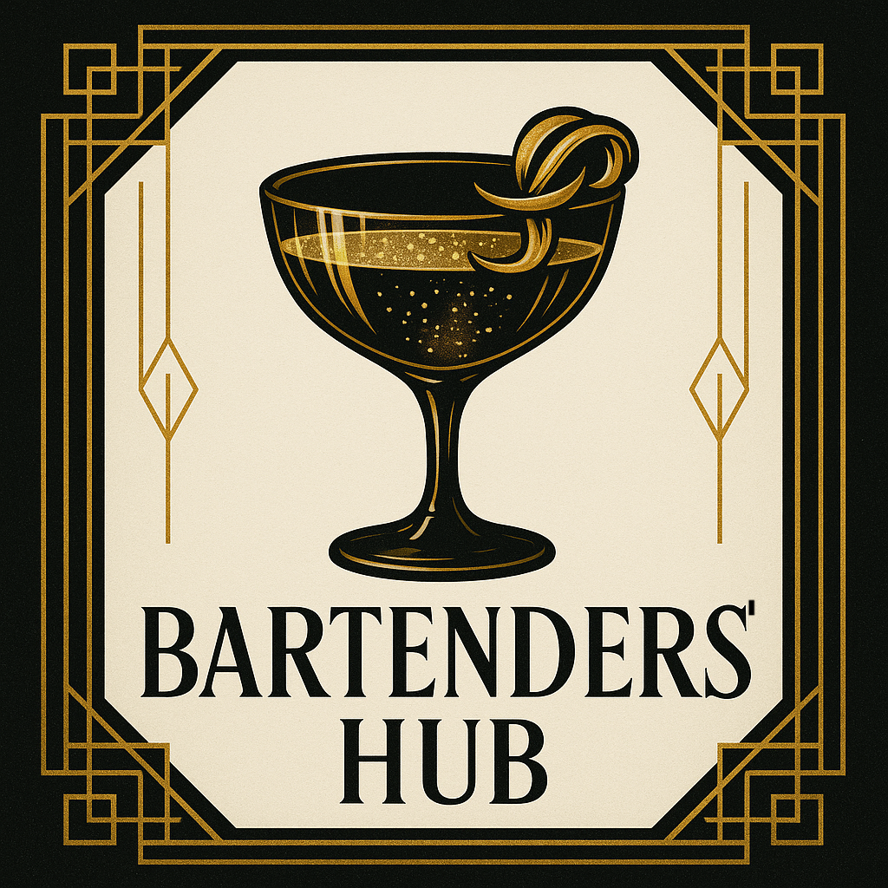

# 🥃 BartendersHub

<div align="center">
  

**Where sophistication meets artistry**

_Step into the golden age of cocktails with the most exclusive bartending
experience_

[](https://reactjs.org/)
[](https://vitejs.dev/)
[](https://tailwindcss.com/)
[](https://developer.mozilla.org/en-US/docs/Web/JavaScript)
[](https://nodejs.org/)
[](https://expressjs.com/)
[](https://www.mongodb.com/)

</div>

---

## 🎭 About The Project

BartendersHub is a sophisticated web application that brings the elegance of the
1920s speakeasy era to modern cocktail culture. Inspired by the Art Deco
movement, our platform connects master mixologists and cocktail enthusiasts in a
premium digital experience.

### ✨ Key Features

-   **🍸 Premium Cocktail Collection** - Curated selection of world-class
    cocktail recipes
-   **👑 Art Deco Design** - Authentic 1920s speakeasy aesthetic with golden
    accents
-   **🎨 Interactive UI** - Smooth animations and elegant transitions
-   **📱 Mobile-Optimized** - Perfectly responsive design for all devices
-   **🌟 Community Hub** - Connect with elite bartenders worldwide
-   **🏆 Master Classes** - Learn from legendary mixologists
-   **💎 Artisan Crafted** - Hand-selected ingredients and techniques

---

## 🚀 Getting Started

### Prerequisites

Make sure you have the following installed:

-   **Node.js** (v18.0 or higher)
-   **npm** or **yarn**
-   **MongoDB** (v5.0 or higher)

### Installation

1. **Clone the repository**

    ```bash
    git clone https://github.com/HelderBalbino/BartendersHub.git
    cd BartendersHub
    ```

2. **Install Frontend dependencies**

    ```bash
    npm install
    # or
    yarn install
    ```

3. **Install Backend dependencies**

    ```bash
    cd backend
    npm install
    cd ..
    ```

4. **Set up environment variables**

    ```bash
    cd backend
    cp .env.example .env
    # Edit .env with your configuration
    ```

5. **Start MongoDB**

    ```bash
    mongod
    # or if using MongoDB service
    sudo service mongod start
    ```

6. **Seed the database** (optional)

    ```bash
    cd backend
    npm run seed
    cd ..
    ```

7. **Start the development servers**

    Frontend (Terminal 1):

    ```bash
    npm run dev
    # or
    yarn dev
    ```

    Backend (Terminal 2):

    ```bash
    cd backend
    npm run dev
    ```

8. **Open your browser**
    - Frontend: `http://localhost:3000`
    - Backend API: `http://localhost:5000`

---

## 🛠️ Built With

### Frontend

| Technology       | Purpose                 | Version |
| ---------------- | ----------------------- | ------- |
| **React**        | Frontend Framework      | 18.0+   |
| **Vite**         | Build Tool & Dev Server | 4.0+    |
| **TailwindCSS**  | Styling Framework       | 3.0+    |
| **React Router** | Navigation              | 6.0+    |
| **React Icons**  | Icon Library            | 4.0+    |

### Backend

| Technology     | Purpose             | Version |
| -------------- | ------------------- | ------- |
| **Node.js**    | Runtime Environment | 18.0+   |
| **Express**    | Web Framework       | 4.0+    |
| **MongoDB**    | Database            | 5.0+    |
| **Mongoose**   | ODM for MongoDB     | 8.0+    |
| **JWT**        | Authentication      | 9.0+    |
| **Cloudinary** | Image Storage       | 1.0+    |
| **Multer**     | File Upload         | 1.0+    |

---

## 📁 Project Structure

```
BartendersHub/
├── 📁 backend/
│   ├── 📁 src/
│   │   ├── 📁 config/
│   │   │   └── 📄 database.js
│   │   ├── 📁 controllers/
│   │   │   ├── 📄 authController.js
│   │   │   ├── 📄 cocktailController.js
│   │   │   └── 📄 userController.js
│   │   ├── 📁 middleware/
│   │   │   ├── 📄 auth.js
│   │   │   ├── 📄 errorHandler.js
│   │   │   └── 📄 rateLimiter.js
│   │   ├── 📁 models/
│   │   │   ├── 📄 User.js
│   │   │   ├── 📄 Cocktail.js
│   │   │   ├── 📄 Follow.js
│   │   │   └── 📄 Favorite.js
│   │   ├── 📁 routes/
│   │   │   ├── 📄 auth.js
│   │   │   ├── 📄 cocktails.js
│   │   │   └── 📄 users.js
│   │   ├── 📁 utils/
│   │   │   ├── 📄 auth.js
│   │   │   ├── 📄 cloudinary.js
│   │   │   └── 📄 seedDatabase.js
│   │   └── 📄 server.js
│   ├── 📄 package.json
│   └── 📄 README.md
├── 📁 public/
│   └── 📄 index.html
├── 📁 src/
│   ├── 📁 assets/
│   │   └── 📁 images/
│   │       └── 🖼️ logo.png
│   ├── 📁 components/
│   │   ├── 📄 CommunitySection.jsx
│   │   ├── 📄 Footer.jsx
│   │   ├── 📄 Hero.jsx
│   │   └── 📄 Navbar.jsx
│   ├── 📁 layouts/
│   │   └── 📄 MainLayout.jsx
│   ├── 📁 pages/
│   │   ├── 📄 CommunityPage.jsx
│   │   ├── 📄 CocktailsPage.jsx
│   │   └── 📄 HomePage.jsx
│   ├── 📄 App.jsx
│   ├── 📄 index.css
│   └── 📄 main.jsx
├── 📄 package.json
├── 📄 tailwind.config.js
├── 📄 vite.config.js
└── 📄 README.md
```

---

## 🎨 Design Philosophy

### Art Deco Aesthetic

-   **Golden Color Palette** - Luxury gold (#F59E0B) with deep blacks
-   **Geometric Patterns** - Classic 1920s geometric designs
-   **Elegant Typography** - Sophisticated font choices with letter spacing
-   **Subtle Animations** - Smooth transitions that enhance user experience

### User Experience

-   **Mobile-First Design** - Optimized for smartphones and tablets
-   **Intuitive Navigation** - Clear routing and user flow
-   **Performance Focused** - Fast loading times and smooth interactions
-   **Accessibility** - WCAG compliant design principles

---

## 🌟 Pages & Features

### 🏠 Home Page

-   Elegant hero section with rotating quotes
-   Premium feature showcase
-   Art Deco styled call-to-action buttons

### 🍹 Cocktails Page

-   Curated collection of premium cocktails
-   Interactive recipe cards
-   Advanced filtering options

### 👥 Community Page

-   Member profiles and statistics
-   Featured bartender spotlight
-   Community engagement features

---

## 🎯 Future Enhancements

-   [ ] **User Authentication** - Login/Register system
-   [ ] **Recipe Submissions** - Allow users to submit cocktail recipes
-   [ ] **Advanced Search** - Filter by ingredients, difficulty, etc.
-   [ ] **Favorites System** - Save favorite cocktails
-   [ ] **Rating & Reviews** - Community-driven recipe ratings
-   [ ] **Mobile App** - React Native version
-   [ ] **API Integration** - Backend API for data management
-   [ ] **Social Features** - Follow bartenders, share recipes

---

## 🤝 Contributing

I welcome contributions from the community! Please follow these steps:

1. **Fork the repository**
2. **Create a feature branch** (`git checkout -b feature/AmazingFeature`)
3. **Commit your changes** (`git commit -m 'Add some AmazingFeature'`)
4. **Push to the branch** (`git push origin feature/AmazingFeature`)
5. **Open a Pull Request**

---

## 📄 License

This project is licensed under the MIT License - see the [LICENSE](LICENSE) file
for details.

---

## 🙏 Acknowledgments

-   **Art Deco Design Movement** - For the timeless aesthetic inspiration
-   **1920s Speakeasy Culture** - For the sophisticated atmosphere
-   **Master Mixologists** - For the cocktail expertise and passion
-   **React Community** - For the amazing ecosystem and tools

---

<div align="center">

**🥃 Crafted with Excellence • Served with Passion • Experienced with Pride 🥃**

_Made with ❤️ and a touch of 1920s glamour_

[](https://github.com/yourusername/bartendershub/stargazers)
[](https://github.com/yourusername/bartendershub/network/members)

</div>
